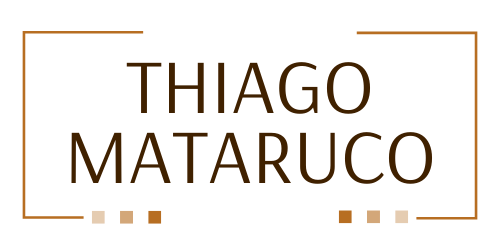

# Landing Page - Thiago Mataruco

> Projeto consiste em uma landing page para o cliente, que trabalha na área de gerenciamento de tráfego.

### Ajustes e melhorias

O projeto ainda está em desenvolvimento e as seguintes partes são planejadas:

- [ ] Barra superior de navegação com links para trechos da página
- [ ] Capa do site, contendo imagem, texto e caixa para contato
- [ ] Seção para apresentação do cliente
- [ ] Seção para apresentação dos serviços
- [ ] Rodapé da página

## 💻 Características do projeto

### Tecnologias utilizadas
* [TypeScript](https://www.typescriptlang.org)
* [React](https://pt-br.reactjs.org)
* [Next.js](https://nextjs.org)
* [Vercel](https://vercel.com) para hospedagem do front-end
* [Sass](https://sass-lang.com)
* etc.

### Observações
* Este software foi desenvolvido no [Visual Studio Code](https://code.visualstudio.com) utilizando o Windows 10 como SO
* Para executar o sistema e comandos no Yarn, foi utilizado o [Windows Subsystem for Linux](https://docs.microsoft.com/pt-br/windows/wsl/install)

## 🔥 Preview
